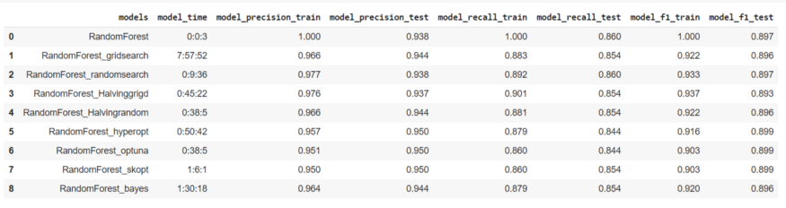
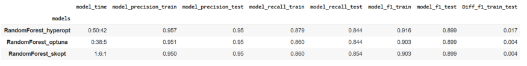
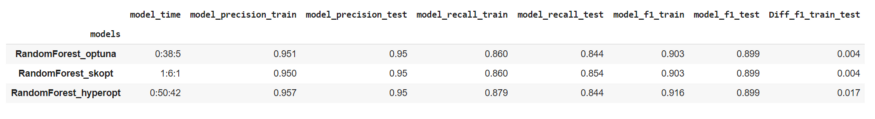

# Different_Hyperparameter_Tuning_Techniques
---
### **Complete Walkthrough** of the process is documented in my **Medium Article**, Do have a look at it from this [link](https://abhigyan-singh282.medium.com/different-types-of-hyper-parameter-tuning-3d99ca624baa).
---

# **Data**
News data obtained from Kaggle. [link](https://www.kaggle.com/colearninglounge/predicting-pulsar-starintermediate)
 
---

# **Objective**
- Objective of this project is to show most of the hyperparameter tuning methods in the industry.
- People can see get code as well as comparison between the models to choose from.
---

# **Dependencies**
- time
- pprint
- pandas
- numpy
- matplotlib
- sklearn
- - skOpt
- hyperOpt
- Optuna
---

# **Models**
- RandomForest
---

# **Metrics**
- Precision
- Recall
- f1
---

# **Performance**

1. Sorting with respect to f1 score on test

2. Sorting with respect to difference between f1 score on train and test

